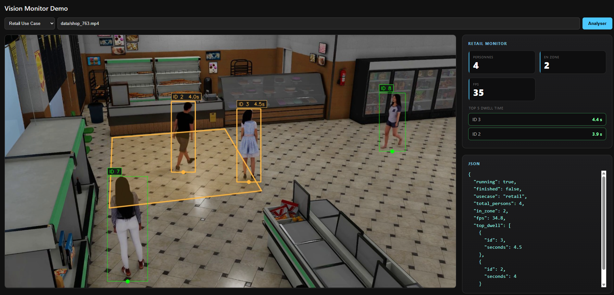

# :computer: Portfolio : Pipeline de Détection, Tracking et Analyse Vidéo en Temps Réel

Pipeline de vision temps réel pour l'analyse de flux vidéo :
**détection**, **suivi multi-objets (MOT)** et **applications métier**
(comptage de personnes et temps de présence, détection de bagages abandonnés,
mesure de vitesse et comptage de véhicules, analyse d'un match de foot). Le tout exposé via une **API web**
(FastAPI + Uvicorn) ou en locale (OpenCV).

> :mortar_board: Pierre Lefebvre - Doctorant DVRC / AID  
> :e-mail: contact : lefebvre.pierre0318@gmail.com  
> :handshake: linkedin : https://www.linkedin.com/in/pierre-lefebvre-29ab03205/  

---

## :mag: Aperçu

Interface web de démonstration permettant de lancer une analyse vidéo, visualiser le flux annoté en temps réel et 
consulter les données calculées pour chaque frame (JSON).

<p align="left">
  
</p>

| Cas d'usage                         | Fonctionnalités                                    |
|-------------------------------------|----------------------------------------------------|
| **:shopping_cart: Retail**          | Temps de présence (*dwell time*) et analyse de fréquentation |
| **:briefcase: Bagages abandonnés**  | Détection de bagages séparés de leur propriétaire  |
| **:vertical_traffic_light: Trafic** | Estimation de vitesse et comptage de véhicules     |
| **:soccer: Soccer**                 | Assignation d'équipe et temps de possession        |

---

## :rocket: Démo

### :shopping_cart: Retail

<p align="left">
  
</p>

- Définition d’une zone d'intérêt polygonale au sol
- Détection et suivi des clients
- Calcul du temps de présence, persistant pour chaque track/personne
- Classement top5 des temps de présence par ordre décroissant

### :briefcase: Bagages abandonnés

<p align="left">
  
</p>

- Suivi des personnes et des bagages
- Logique d’état : porté, immobile, séparé, abandonné
- Détection d’un bagage resté immobile et séparé de son propriétaire
- Déclenchement d’une alerte visuelle en cas d’abandon

### :vertical_traffic_light: Trafic

<p align="left">
  
</p>

- Détection et suivi de véhicules
- Estimation de la vitesse par projection homographique image → route
- Lissage des vitesses avec filtre de Savitzky-Golay
- Comptage bidirectionnel des véhicules au passage de la ligne centrale

### :soccer: Soccer

https://github.com/user-attachments/assets/c11642df-3507-4ce2-8da4-b0d0b8c78c22

- Détection des joueurs, arbitres, gardien et de la balle
- Tracking avec compensation du mouvement caméra (BoT-SORT -> GMC) 
- Association d'une équipe par clustering sur la couleur du maillot (k-means)
- Calcul du temps de possession pour chaque équipe

### Vous aimez les heatmaps ? Moi aussi :sunglasses:

<p align="left">
  
</p>

---

## :file_folder: Structure du dépôt

```
assets/         # images/gifs pour le README
src/
  detection/    # détecteurs ONNX + post-processing
  tracking/     # trackers MOT réimplémentés (ByteTrack, BoT-SORT, OC-SORT, SORT, C-BIoU)
  retail/       # comptage clients + temps de présence par zone
  luggage/      # détection de bagages abandonnés
  traffic/      # comptage + vitesses des véhicules
  soccer/       # association équipe + temps possession
  api/          # FastAPI, démo web, registre de use cases
tools/          # zone_drawer, calibration homographie
tests/          # plusieurs tests unitaires par use case
configs/        # configuration use case (YAML) + zones/homographies (JSON)
```

---

## :floppy_disk: Installation

Créez puis activez l’environnement Conda :

```bash
conda create -n vision python=3.10
conda activate tracking_env
```

Installez ensuite les dépendances Python :

```bash
pip install -r requirements.txt
```

Ou créez directement l’environnement Conda depuis le fichier :

```bash
conda env create -f environment.yml
conda activate tracking_env
```

> **Note**  
> Les modèles et les données sont disponibles au lien suivant : 
[google drive](https://drive.google.com/drive/folders/1rGXeVLXYTYva2PiWnTN28DY-48cRrAqm?usp=sharing)  
> Placer les modèles dans `models/`, les vidéos dans `data/` et les fichiers 
de configuration dans `configs/`

---

## :gear: Architecture

Structure modulaire en trois couches : on peut brancher n'importe quel
détecteur sur n'importe quel tracker, puis n'importe quelle logique métier
par-dessus - facilite l'évolutivité et la maintenabilité.

```
                  ┌────────────────┐
   flux vidéo ──► │    Détection   │    YOLO / YOLOX (ONNX)
                  └────────┬───────┘
                           │  détections (bbox + classes)
                  ┌────────▼───────┐
                  │    Tracking    │    ByteTrack · BoT-SORT · OC-SORT · SORT · C-BIoU
                  └────────┬───────┘
                           │  tracks (identités persistantes)
                  ┌────────▼────────┐
                  │ Logique métier  │   retail · luggage · trafic · soccer ...
                  └────────┬────────┘
                           │  frame annotée + métriques
                  ┌────────▼───────┐
                  │       API      │    FastAPI · stream MJPEG · dashboard
                  └────────────────┘
```

- **Détection** - modèles YOLO / YOLOX optimisés ONNX pour l’inférence temps réel.  
- **Tracking** - trackers MOT réimplémentés pour comparer robustesse, vitesse et stabilité des identités.    
- **Logique métier** - transformation des trajectoires en indicateurs exploitables : dwell time, comptage, vitesse, alertes.    
- **API** - interface web permettant de lancer une analyse et de visualiser le flux annoté.  

Principaux endpoints de l'API :

| Endpoint | Rôle |
|---|---|
| `GET /` | Interface web de démonstration |
| `POST /analyze` | Lancement d’une analyse vidéo |
| `GET /stream` | Flux vidéo annoté en MJPEG |
| `GET /monitor` / `GET /stats` | État courant et métriques |

---

## :wrench: Utilisation

### Lancer l'API (recommandé)

```bash
uvicorn src.api.app:app --host 0.0.0.0 --port 8000
```

Ouvrir **http://localhost:8000**, sélectionner un cas d’usage puis lancer l’analyse.

### Exécuter un use case individuellement

```bash
python tests/test_retail.py
python tests/test_trafic.py
python tests/test_luggage_monitor.py
python tests/soccer.py

```

> **Raccourcis**
>
> - `Espace` : pause / reprise
> - `Q` : quitter
> - Profiling affiché en console toutes les 100 frames

### Outils de configuration

**Définition d'une zone d'intérêt (retail)**

```bash
python tools/zone_drawer.py
```

**Calibration d'une homographie (traffic / luggage)**

```bash
python tools/homography_calibrator.py
```

---

## :seedling: Pistes d'évolution

### Général
- Conteneurisation Docker de l'API
- Fine-tuning des détecteurs sur le domaine cible pour améliorer le rappel
- Ajout de détecteurs transformer-based (RT-DETR)

### Amélioration des use-cases existants
- Retail : interactions avec les articles, heatmap de fréquentation, multi-zones
- Trafic : classification par type de véhicules, détection d'infractions
- Soccer : tracker spécifique pour la balle, tracking by query (e.g. TrackFormer), méthode de clustering plus robuste (basée sur extraction des features de ReID)

### Nouveaux use-cases
- Sécurité : détection de chute, port de matériel de sécurité, franchissement de zones interdites
- Parking : détection de places libres/occupées, temps de stationnement
- Football : attribution d'équipes, possession de balle, OCR sur les numéros des maillots


---

## :open_book: Références

### Trackers MOT réimplémentés

| Tracker | Papier | Code                                            |
|----------|---------|-------------------------------------------------|
| **SORT** | [Bewley et al. (2016)](https://arxiv.org/abs/1602.00763) | [GitHub](https://github.com/abewley/sort)       |
| **ByteTrack** | [Zhang et al. (2022)](https://arxiv.org/abs/2110.06864) | [GitHub](https://github.com/ifzhang/ByteTrack)  |
| **BoT-SORT** | [Aharon et al. (2022)](https://arxiv.org/abs/2206.14651) | [GitHub](https://github.com/NirAharon/BoT-SORT) |
| **OC-SORT** | [Cao et al. (2023)](https://arxiv.org/abs/2203.14360) | [GitHub](https://github.com/noahcao/OC_SORT)    |
| **C-BIoU** | [Yang et al. (2023)](https://arxiv.org/abs/2211.14317) | -                                               |

### Détecteurs

- **YOLOX** - [Article](https://arxiv.org/abs/2107.08430) · [GitHub](https://github.com/Megvii-BaseDetection/YOLOX)
- **Ultralytics YOLO** - [GitHub](https://github.com/ultralytics/ultralytics)
